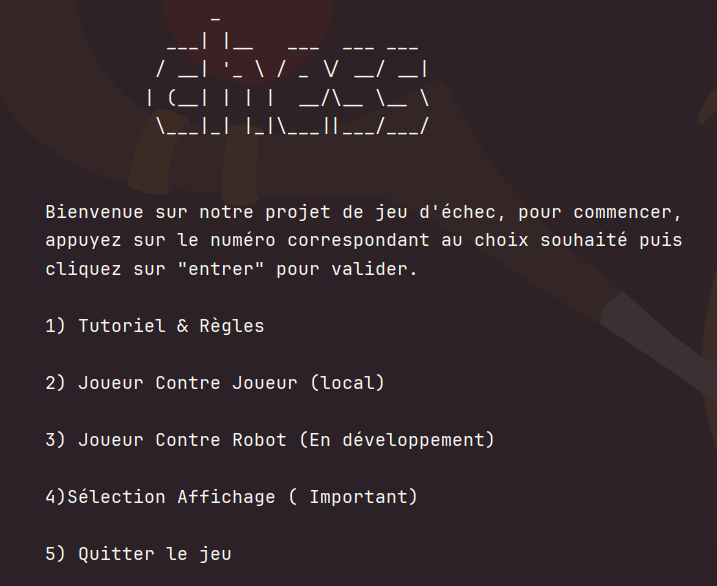
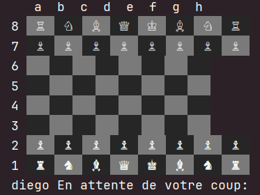

# Projet Jeux d'echec
## Création d'un jeux d'echec sur terminal

Ce projet a été réalisé dans le cadre de la SAE S1.01 en équipe de deux.
Il s'agit d’un jeu d’échecs fonctionnant entièrement dans le terminal.

Toutes les interactions se font via le terminal. Deux styles de plateau sont disponibles, 
et les commandes pour jouer sont accessibles directement depuis le jeu.

## 🎮 Aperçu du jeu

Écran d’accueil

Plateau de jeu

## ⚙️ Installation

1. Cloner le projet à l’aide de l’URL suivante: https://github.com/miamcookie/Projet-echec.git

2. Compiler et exécuter le fichier Test.java situé dans le projet.

## 🐞 Bugs connus

- Lors du lancement, l’option Pixel Art ne fonctionne pas.
- Les cases contenant des pièces sont plus grandes que les cases vides.

